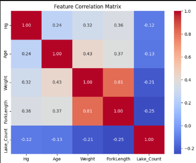
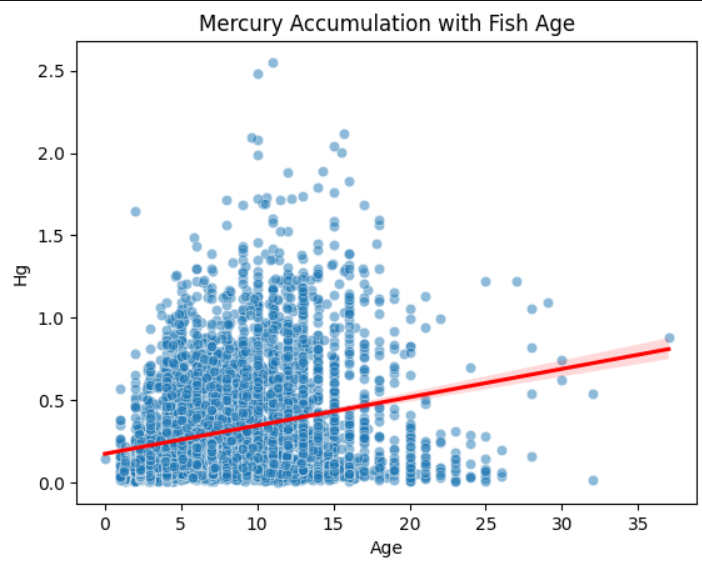
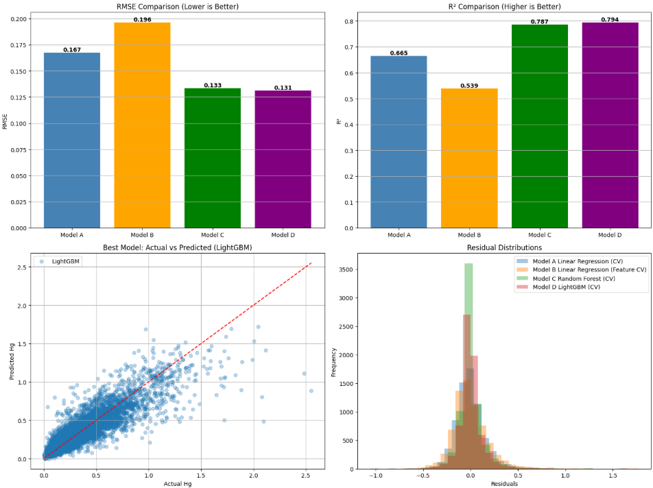
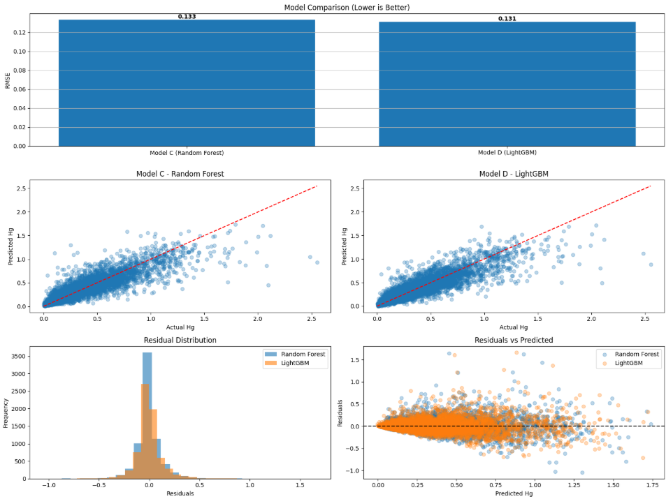

# Fish Mercury Analysis

A data science and machine learning project analyzing mercury concentrations in fish from Alberta waterbodies.

## Project Overview

This project investigates factors associated with mercury concentration in fish and evaluates several approaches for predicting mercury levels using biological, geographic, and waterbody characteristics.

The analysis was performed in Python using a dataset containing approximately 7,000 fish observations from 141 Alberta waterbodies.

## Exploratory Data Analysis

### Feature Correlation Matrix

The correlation matrix highlights relationships between mercury concentration and the numerical features used in the analysis.

### Mercury Accumulation with Fish Age

Mercury concentration generally increases with fish age, although substantial variation exists across individual observations.

## Analysis

The project includes:

- Data cleaning and preparation
- Exploratory data analysis
- Missing-value analysis and imputation
- Feature engineering
- Cross-validation
- Linear regression modeling
- Random Forest modeling
- LightGBM modeling
- Model comparison using RMSE and R²
- Residual and prediction-error analysis

## Dataset

The dataset contains information including:

- Waterbody name and type
- Land use region
- Fish species
- Sex
- Maturity
- Fork length
- Weight
- Age
- Mercury concentration

The repository also includes the source data and a spreadsheet describing the dataset columns.

## Feature Engineering

Several features were developed during the analysis, including:

- Waterbody-level average mercury concentration
- Waterbody sample counts
- Waterbody age averages
- Grouping of waterbodies with elevated mercury concentrations
- Imputed age values
- Imputed sex values

Care was taken during model validation to avoid data leakage when calculating waterbody-level features.

## Modeling

Multiple approaches were evaluated, including:

- Linear Regression
- Feature-enhanced Linear Regression
- Random Forest
- LightGBM

Five-fold cross-validation was used to compare model performance. Evaluation included RMSE, R², actual-versus-predicted comparisons, and residual analysis.

The analysis also examined model performance across different fish characteristics and geographic regions, including the tendency of predictive models to underpredict observations with particularly high mercury concentrations.

## Model Results

The final model comparison showed that the tree-based models substantially improved predictive performance over the linear regression approaches. LightGBM produced the strongest overall results.

### Random Forest vs. LightGBM

Random Forest and LightGBM were compared in greater detail using RMSE, actual-versus-predicted values, residual distributions, and residual-versus-predicted analysis.

## Technologies

- Python
- pandas
- NumPy
- scikit-learn
- LightGBM
- statsmodels
- matplotlib
- seaborn
- Jupyter Notebook
- Git / GitHub

## Repository Contents

- `FishMercury_final.ipynb` — complete analysis and modeling notebook
- `hg-in-fish-ah-1997-2021_march2024xlsx.xlsx` — source dataset
- `hg-in-fish-column-descriptions.xlsx` — dataset column descriptions
- `images/` — selected visualizations used in the README

## Author

Chris Giannakopoulos